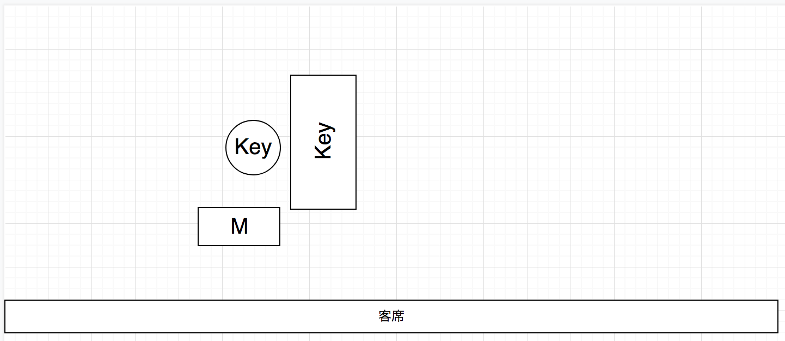
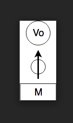
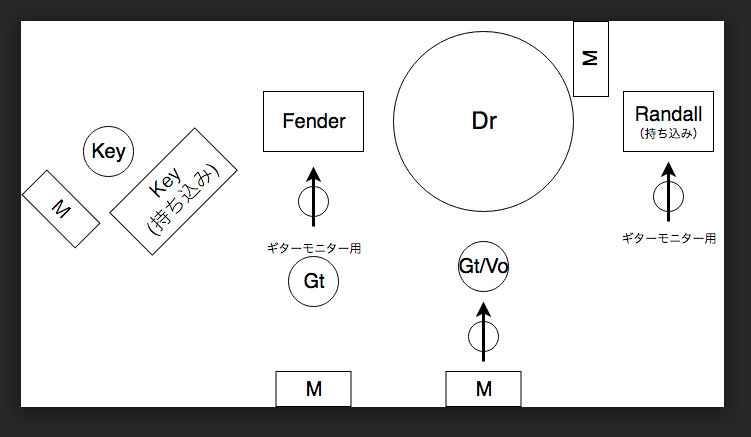

# セッティング図

## Yogo Piano

ピアノは持ち込み  
#### 簡単な流れ

17:00 Yogoくん入場、会場暗転、Yogoくんにスポットライトが当たる

ワーグナーの結婚行進曲を演奏（オルガンの音色）

一曲目演奏終了後、明転、二曲目演奏開始

司会から、新郎新婦入場の言葉

新郎新婦入場、キャンドルサービス（LED）を開始

## Nao Kondo

ボーカルマイクのみ

カラオケ音源

#### 簡単な流れ

司会が「それでは、Nao Kondoさん、お願いします」
というフリでカラオケ音源が流れ、演奏開始。

## ざまバンド

キーボードは持ち込みますが、もしかすると据え置きのキーボードを使わせていただくかもしれません。  
Randallのみ、持ち込みます。

#### 簡単な流れ

19:30ごろにステージセッティングが終わり次第、  
「本日は、打田夫妻ウェディングコンサートにご来場頂き誠にありがとうございました。式の最後を締めくくるのは、ギターボーカリスト新郎、ドラム新婦による、バンドの演奏です！」  
というフリで出演者が入場し、演奏開始。
